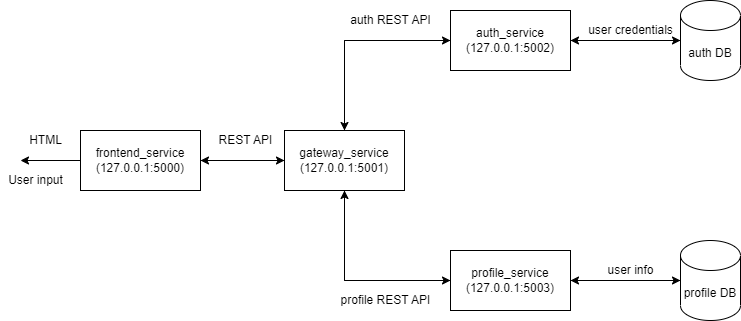

# Services communication schema

- frontend - service to communicate with user input and return HTML content
- gateway - service to handle all user input and convert them to sequence of requests
- auth - service to authenticate user
- profile - service to get user specific info (name, links, friends, etc.)